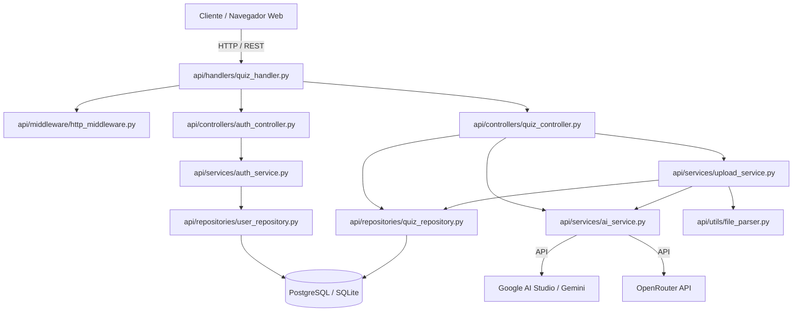

# Quiz Study — Documento de Arquitetura, Busca Rápida e Governança

Este documento consolida a arquitetura completa do **Quiz Study**, funcionando como guia fixo para desenvolvedores humanos e agentes de IA localizarem instantaneamente qualquer parte do sistema sem necessidade de reanalisar o repositório inteiro a cada alteração.

---

## 🏗️ 1. Diagrama de Arquitetura



---

## 📍 2. Índice Fixo de Onde Procurar

Ao receber uma demanda, consulte esta tabela para abrir diretamente os arquivos envolvidos:

### 🎨 Frontend & Design System
| Objetivo | Arquivo Principal | Arquivos Secundários |
| :--- | :--- | :--- |
| **Estilos, cores, temas, responsividade mobile/desktop** | `web/styles.css` | `web/modules/theme.js` |
| **Estrutura visual HTML, modais, cabeçalho, textos** | `web/index.html` | `web/login.html`, `web/register.html` |
| **Eventos de tela, ciclo de prova, envio, estado local** | `web/app.js` | — |
| **Mapeamento de atalhos de teclado (A-D, 1-4, etc.)** | `web/modules/shortcuts.js` | `web/app.js` |
| **Analytics e métricas pedagógicas de desempenho** | `web/modules/stats.js` | `web/app.js` |

### 🧠 Backend, Serviços & IA
| Objetivo | Arquivo Principal | Arquivos Secundários |
| :--- | :--- | :--- |
| **IA: Geração por tema, estruturação de arquivo, gabaritos** | `api/services/ai_service.py` | `api/utils/config.py` |
| **Upload: Extração de texto de TXT, PDF, DOCX e corte** | `api/services/upload_service.py` | `api/utils/file_parser.py` |
| **Roteamento de URLs, endpoints da API, rate limit** | `api/handlers/quiz_handler.py` | `api/middleware/http_middleware.py` |
| **Autenticação, hash de senhas PBKDF2, tokens de sessão (hash SHA-256)** | `api/services/auth_service.py` | `api/controllers/auth_controller.py` |
| **Banco de dados, tabelas, migrações e persistência** | `api/database/migrations.py` | `api/repositories/quiz_repository.py` |
| **Servidor HTTP nativo e inicialização** | `quiz_api.py` | `api/utils/config.py` |

---

## 🔒 3. Governança: Liberdades e Proibições

### 🟢 O que é PERMITIDO (Liberdade total de evolução)
- Aperfeiçoar o design visual em `web/styles.css` (cores, animações, acessibilidade, breakpoints de tela).
- Criar novos componentes visuais ou refatorar o JavaScript em `web/modules/`.
- Ajustar heurísticas de regex em `api/utils/file_parser.py` para suportar novos formatos de questões.
- Otimizar prompts de IA em `api/services/ai_service.py` para respostas mais precisas e didáticas.
- Adicionar novos testes automatizados em `tests/`.

### 🔴 O que é PROIBIDO (Zonas restritas de segurança)
1. **Credenciais:** Jamais commitar ou alterar dados reais do arquivo `.env`. Atualizações de chaves devem ser registradas apenas em `.env.example`.
2. **Dependências:** Não instalar frameworks CSS (Bootstrap, Tailwind) nem frameworks JS pesados (React, Vue). O projeto é intencionalmente **Vanilla**.
3. **Destruição de Dados:** Não adicionar `DROP TABLE` ou comandos destrutivos em `api/database/migrations.py`. Todas as migrações devem ser seguras e idempotentes.
4. **Segurança:** Não desativar limitadores de taxa (`RateLimiter`), hashing de senha ou validação de permissões de administrador.
5. **Git:** Não executar comandos de reescrita de histórico (`git reset --hard`, `git push --force`).
6. **Varredura Cega:** Evitar listar pastas inteiras quando o alvo da alteração já estiver mapeado.

---

## 🧪 4. Como Executar e Validar

- **Rodar o servidor localmente:**
  ```bash
  python quiz_api.py
  ```
- **Rodar a suíte completa de testes:**
  ```bash
  python -m unittest discover tests
  ```
- **Rodar um teste específico:**
  ```bash
  python -m unittest tests/test_security_fixes.py
  ```

---

## 🛡️ 5. Modelo de Segurança de Dados e Decisão Arquitetural sobre RLS

### 5.1 Decisão sobre Row-Level Security (RLS) vs. Isolamento na Aplicação
- **Decisão:** Adoção de **Application-Level Tenant Isolation** (Isolamento Lógico na Camada de Repositório) respaldada por queries SQL estritamente parametrizadas (`WHERE is_public = TRUE OR created_by = %s` e `WHERE user_id = %s`).
- **Motivação Técnica:** O backend conecta-se ao PostgreSQL através de connection pools em ambiente serverless/Vercel (Neon/PgBouncer) sob uma única role de serviço. A implementação de RLS nativo com `FORCE ROW LEVEL SECURITY` dependeria de variáveis dinâmicas de sessão (`current_setting('app.user_id')`) configuradas a cada requisição via `SET LOCAL`, o que introduziria overhead de roundtrips e riscos de reaproveitamento de estado no pool transacional.
- **Garantia de Integridade:** Todas as rotas de leitura e correção passam obrigatoriamente pelos repositórios que aplicam os filtros de propriedade. Alunos não podem alterar a flag `is_public` (restrita a administradores).
- **Alinhamento de Schema:** A coluna `is_public` possui `DEFAULT FALSE` padronizado tanto no `CREATE TABLE` quanto no `ALTER TABLE`, prevenindo que quizzes existentes se tornem públicos inadvertidamente.

### 5.2 Mitigações de Auditoria Implementadas
1. **Mitigação de Timing Attack no Login:** Quando um nome de usuário não é encontrado, o serviço executa PBKDF2-HMAC-SHA256 (600.000 iterações) contra salt e hash sentinelas (`_DUMMY_SALT`, `_DUMMY_HASH`), equalizando o tempo de resposta (~175 ms) em relação a usuários existentes e impedindo a enumeração de contas por tempo.
2. **Rate Limiting Baseado em Falhas e Chaves Compostas:** O endpoint `/api/auth/login` isola tentativas com chave composta `(IP + Usuário)` e contabiliza apenas falhas consecutivas. Isso elimina:
   - **Bloqueio de conta por terceiros (Problema A):** Um atacante forçando tentativas para `admin` só bloqueia o seu próprio IP para aquele usuário, permitindo que o administrador legítimo acesse sua conta normalmente a partir do seu IP.
   - **Contenção em redes compartilhadas/NAT (Problema B):** Logins bem-sucedidos não gastam cota de rate limit e limpam o contador de falhas daquele IP/usuário.
3. **Criptografia em Trânsito:** Bancos remotos utilizam `sslmode=verify-full` por padrão (ajustável via `DB_SSLMODE`), garantindo validação completa de certificados TLS/SSL.
